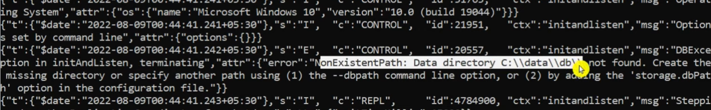

# Adding MongoDB to Node.js

## 1. Why MongoDB?

- All right, so now that we've built out a very basic server using node JS and Express for our full stack application, the next thing that we're going to do is see how to persist our data in a database. Now, since both our client and server side are written in JavaScript, it makes sense to persist our data in a database that plays very nicely with JavaScript and has a similar format to the kind of data that we want to store.
- And for that, we don't need to look any further than MongoDB. Now, MongoDB is what's called a non-relational database, and basically what this means is that we can just sort of push JavaScript data into it without worrying too much about how that data is formatted.
- Now, in the case of MongoDB, what we can do is simply hand our database any kind of JSON that we want, and it will just store that for us and allow us to retrieve them later whenever we need them. All right, now this is in pretty stark contrast to some of the traditional relational databases, such as SQL-based databases like MySQL, where the structure of the data and the fields that it contains have to generally be defined in advance and adhered to whenever we add new data.
- All right, so working with relational databases also generally requires some knowledge of SQL, of course, and so by using this, we would sort of fall short of our ideal of being able to write our full stack application using only JavaScript. So anyway, that's MongoDB, and that's why we're going to be using it here. So let's get started and see how to add this to our app.
- https://www.mongodb.com/
- https://www.mysql.com/

## 2. Downloading and installing MongoDB

- All right, so now that we know what MongoDB is, and what we're going to be using it for, let's get it up and running on your computer. Now, if you're using a Mac like I am in this video, I highly recommend that you install MongoDB using Homebrew, Or if you're using some other operating systems such as Windows, I'm afraid that I really can't help you too much with that. But I'm going to direct you to MongoDB's installation instructions for MongoDB Community Edition.
- And in order to find these, all you have to do is search for MongoDB Community Edition installation tutorials, and you should be able to find this page, which contains a pretty extensive listing of all the different operating systems that you might need to install MongoDB on.
- So, like I said, the way that I'm going to be installing this on Mac is using something called homebrew, which is a really nice package manager for the Mac operating system, right? It is to Mac what, let's say, NPM is to Node JS projects. It just makes it really easy to install different things that you can use.
- So, I've already got Homebrew installed on my computer, but if you don't, you're going to want to go to Homebrew's website, which is http://www.brew.sh.com currently, and install it basically just by copying this script here, and running that in your terminal. You're just going to paste that in your terminal, and run it, and wait until it finishes. And once you've finished that what you should be able to do is go back to your terminal and type something like "brew-version" and hit enter, basically that will just tell you what version of Homebrew you have. Mine's currently 3, 5, 2, yours might be something higher than that, but all of this stuff should be pretty much the same.
- And, once you have Homebrew installed, you're going to want to install MongoDB by running the command "brew install". And, then you're going to say "MongoDB-community@5.0" now this "@5.0" thing, basically, that's just making sure that we're at the same version at the point that you're watching this there might be a later version, but you know, I would still recommend installing this just so everything's going to be the same for you. So let's hit enter, and this should install the MongoDB Community Server on our computer.

  - After installation add the bin folder path in environment PATH variable.

    [Download and Install MongoDB in Windows](https://www.mongodb.com/try/download/community)

    [Download and Install MongoDB shell](https://www.mongodb.com/try/download/shell)
    keep it in C folder

  - Check using this command
    - `mongod --version`
    - `mongod`
  - You will get the error If you don't create the default directory. like this error
    
  - Our data will be stored in the default directory.

- And, after that all we have to do is create the default database directory, where our MongoDB files are going to live. Now to do this, all we have to do is create a new folder inside our my blog backend. And, I'm just going to call this folder something like data. And in fact, we can even call it like MongoDB data if we want something like that, and this is going to be the folder that will have MongoDB store our data in.
  - data/db
- So, now that we've done that, what we should be able to do is start the "Mongo demon", which basically the Mongo demon is just a process that runs in the background, and allows us to interact with our database via a shell. For example, we'll see how to do that in a minute. And, we should be able to start the Mongo demon by saying "MongoD" and then we're going to say "--DB path", and we're going to point it at that folder we just created.
- So, we'll say "Mongodbdata" and hit enter, and that should start the Mongo demon running in the background. Now, I already have it running currently on my computer, so I'm not going to run this command, but you'll probably want to leave that running in your terminal, and just open up a new terminal alongside that. Okay, So once MongoDB is running you should be able to connect to it via the Mongo shell by typing **"Mongo" or "mongosh"**, and hitting enter. And, this again will bring up, what's called the Mongo shell which is basically just a little terminal that you can use to type in MongoDB commands.
- So, the first thing that we're going to do here is create a new database called "react blog DB". And, the way that we can do that is simply by typing "use", and then saying the database name, and our case "react-blog-DB" `use react-blog-DB`, and hitting enter. And, we're now in our database. So, what's next? Well, since we're planning on replacing this fake database JavaScript array thing that we had in our "Server.JS" file with MongoDB.

  ```
  use react-blog-DB
  ```

- What we're going to do is insert this data into our database so that we can persist it better. So, what this is going to look like is in our Mongo shell we're going to say "DB.articles.insertmany", and this is basically just a function that we call with all of the different documents that we want to insert.
- Now, before we do this, let's just go through a little bit of MongoDB terminology. This article's thing that you see here after DB is what's referred to as a collection. In MongoDB each database is composed of a few collections, or many collections, depending on how big your database is. And, these collections contain any number of JSON objects, and we call these objects documents.
- So, what we're going to insert here is a series of documents. And, basically all we need to do for that is copy what we had here for our articles info. So, I'm just going to select all of this and copy it. And, then we'll go down here and paste it, and I'm just going to hit paste. And then we just need to close off the parentheses, and hit enter. And, what you should see as output is this object that says "acknowledged true", which means that everything went well.
  ```
  db.articles.insertmany([{key: value}, {key: value}])
  ```
- And, we also have this inserted IDs thing, which is basically all of the randomly generated IDs that MongoDB has assigned to those things that we just inserted. So, if you want to see all of the documents in our database now, what you should be able to do is just say "DB.articles.find" with an empty object in between those parentheses there and hit enter. And, sure enough, you'll see all of that data printed out.
- Now, if you want to see this printed out in a nicer way, you can always add ".pretty" on the end of that. And, that will print that out in a nicely formatted way for us. Okay, so those are two of the basic commands that you'll be using in the MongoDB shell.
- One more thing that I want to point out is if you want to find a single object in MongoDB, right? If you want to filter by something, what you can do is for this find function, you're just going to specify some sort of property that you want to look for, and the value that it should contain.
- So let's say that we want to find the article with the name, "learn-react". Well, all we need to do for that is add "name-learn-react" to this object. This is called the query object in MongoDB. And if we hit enter, we'll see that that gives us the article that matches that criteria. Okay. And if there are several articles that match that criteria, it will just return all of them.
  ```
  db.articles.find({name: 'learn-react'}).pretty()
  ```
- So, we'll say up votes zero, for example if we want to get all of the articles that have zero up votes and, we'll see that that returns several articles. Okay, So at this point our database is set up to work with our backend.
  ```
  db.articles.find({upvotes: 0}).pretty()
  ```
- So, the next thing that we're going to see how to do is actually start incorporating MongoDB into our express server, and making queries to it from our endpoints. One last thing is that in order to exit out of your Mongo shell, all you need to do is press "control+C" ,and that will bring you back to your terminal.

## 3. Adding MongoDB to Express

- All right, so now that we've got MongoDB up and running on our machine as well as some basic data we can use for development, let's see how we can incorporate this into our Express server. Now, the first thing that we're going to want to do, of course, is install the MongoDB driver package into our project. And we can do that by just saying npm install mongodb, and hitting Enter, all right.
- So that's the name of the NPM package here. And this package is basically just going to allow us to do the same thing inside our Node.js code as we did in the Mongo shell, right? So it will allow us to connect to a database and make queries to that database. So since we're going to be connecting to the database and using that data now, what we can do is actually remove this article's info array.
- And eventually we're going to need to replace a lot of the logic inside these endpoints that we defined, since instead of just modifying JavaScript objects in memory, we're actually going to be making queries to the Mongo database.
- So, first though what we're going to do is create a new endpoint that will allow our client's side to actually load the information for a given article, right? So our article page, as you'll see later on, is going to need to know how many up votes an article has, as well as what comments that article has so that it can display those.
- And in order to make that happen, we're going to need to create a new endpoint here just for that purpose. So here's what the endpoint is going to look like. We're going to say app.get, and the path here is going to be slash /api/articles/name, all right, and this name is a URL parameter here. And then we're going to add our callback function and inside this callback function, basically all we're going to need to do is get the current value of this name URL parameter, and use that to query MongoDB and get the information for that article.
- Okay, so first things first, let's just get the value of the URL parameter by saying const name equals request.params. And now what we're going to need to do is connect to MongoDB and make a query to it. So in order to do this, first of all, we're going to need to import something from the MongoDB package that we just installed. And that's going to look like this.
- We're going to say import MongoClient from MongoDB and this Mongo client thing is what we can use to actually connect to the database. So down here, what we're going to do is say, const client equals new MongoClient. And then we need to pass in the URL of our Mongo database. Now yours should be the same as mine here because we're just connecting to our local MongoDB instance that we have running. So that's going to be mongodb://. And then we're going to say, 127.0.0.1, right? So that's local host.
- But we do need to use the actual IP address in order for this to work. And then we're going to specify the port, which is going to be 27017. All right, and that's pretty much it. The next thing that we're going to need to do is actually have this client connect.
- And to do that, we just need to say await client.connect. All right, so this is asynchronous which is why we need the await keyword here. And that means that we need the async keyword added to this callback function as well. And don't worry too much if you're not familiar with async and await. Just know that they're a nice way to deal with asynchronous code in JavaScript. Okay, so at this point we have a connection created to our Mongo database.
- So we're going to need to get the specific database that we created earlier. And to do that, we just need to say, const db equals client.db. And then we need to specify the name of our database, right? Remember that we said, react-blog-db, and we set that as the name of our database. So this will give us a reference to our database. This is very similar to what we did in the shell when we said use react-blog-db, except this is obviously the Node.js version of doing that instead of in the shell.
- And now that we have a reference to that database, we can finally make our query to load the article by its name. And that's going to look like this. We're going to say, const article equals await db.collection, articles. And then we're going to say, dot findOne. And the criteria we're going to be searching for here is the name property of that article should be equal to the name URL parameter.
- All right, so a few things I want to point out about this line here that we just typed out. The first thing is that instead of saying db.articles as we did in the shell, we said db.collection articles. And that's just a little difference between how things work in the shell versus how things are done in Node.js, right? So in Node.js, you have to say db.collection, and actually pass the collection name as a string, instead of being able to just say db dot and then the collection name.
- And the second thing I wanted to point out is, that we used this findOne function, which basically allows us to find a single document inside a MongoDB collection. All right, so we generally use this when we're searching for a document by a unique ID, and we know that at most we're going to get one result back, right? When we know that we're not going to get several results back, for example, if we were searching for all of the articles with zero up votes, let's say.
- Okay, so now that we have the article, let's just test this out by sending it back to the client. And to do that, we just need to say response dot send, and we're going to send that article back. Now so far, we've mainly been sending back strings from our node server, but when we're sending back JSON data as we are in this case, what we're going to want to do instead is use the response dot json function, which basically just makes sure that the correct headers are set on that response. And that should really be all we need.

  ```js
  import express from "express";
  import { MongoClient } from "mongodb";
  const app = express();
  app.use(express.json());

  app.get("/api/articles/:name", async (req, res) => {
    const { name } = req.params;

    const client = new MongoClient("mongodb://127.0.0.1:27017");
    await client.connect();

    const db = client.db("react-blog-db"); // use react-blog-db;
    const article = await db.collection("articles").findOne({ name });

    if (article) {
      res.json(article);
    } else {
      res.sendStatus(404).send("Articles not found!");
    }
  });

  app.listen(8000, () => {
    console.log("Server is listening on port 8000");
  });
  ```

- So let's make sure our server is running. And if you don't have that running. you can do so by running npm run dev and hitting Enter. And then let's head over to Postman and send a request. It's going to be a get request sent to API/articles/ and then we're going to fill in the ID of one of the articles. And if we click send, we should see that sure enough, we get the data for that article back from the server.
- All right, and you can try this out if you want to do learn Node for example, and click Send, you'll see that that will give us back the data for learn Node. And if we want to look up our MongoDB article, I believe the name for that is just MongoDB. So we'll click send, and sure enough, we'll see the data for that article comes back as well.
- So one last thing that we'll want to do here now is, in case this article doesn't exist, just like we did in our other endpoints down here, we're going to want to just send back some kind of alternative response. So what we'll do is say, after we get the article, that is, if article then, and only then will we want to try and send that article back to the client.
- Otherwise, what we're going to want to do is send back some sort of status code. Now, in this case, the 404 status code would be appropriate since we didn't find the article with that corresponding name. So what we can do to send back just a 404 status code is, we can say response dot sendStatus 404, okay. And if you wanted to send back an extra message or something like that, you could just say response dot status 404, and then say dot send, with a message like article not found.
- But generally sending back a 404 status code alone is going to be enough. And we can actually test this out if we go back to Postman and try and load an article with an ID that doesn't exist. And if we click Send now, what we'll see is that sure enough we get back a 404 status code that tells us not found. All right, so that's all we need to do to create this endpoint that will allow our front end eventually to load info for a specific article. And the next thing that we're going to take a look at is how to rewrite our upvote endpoint to use MongoDB as well.

## 4. Rewriting your upvote endpoint

## 5. Rewriting your comments endpoint
